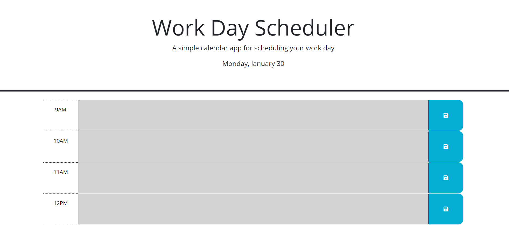

# Work-Day-Scheduler

# Description Of Application:
This site is a workday scheduler, that allows the user to input text into a timeblock for each hour of the workday. The text can be saved by clicking a "lock" button at the end of each timeblock, and the text inputted will persist upon reloading of the page due to local storage being utilized. As the day progresses, past hours will be grey in color, the current hour will be red, and future hours will be green.

# Screenshot Of Application:

# Link To Deployed Website:
https://999888z.github.io/Work-Day-Scheduler/